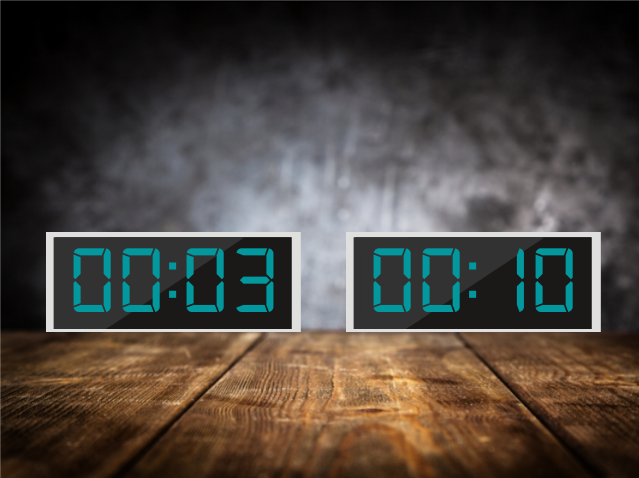

# TwoClocks
During my studies, I always find myself in a need to take breaks every certain period,
and I was interested in taking this as a project.
The aim was to use as less as possible libraries and headers with pure C, sadly I had to use objc to run audio (casting objc code to pure C is doable via objc_sendMsg, however it is un-maintainable, and super buggy)


## Naming Conventions 
might not be optimal but I love to have some standrisation in naming
##### gVarName       for globbal
##### varName        for normal variables
##### FULL_CAPITAL   for macros
##### FunctionName   for function
##### some_type_t    for my own structs
##### some_file.c/h  for file names

## Requirements 
1. Ninja build System 
2. CMake 3.18+
3. C99


---
## Build 
```
git clone https://github.com/Haiderahandali/TwoClocks.git
cd TwoClocks
git submodule init 
git submodule update
cmake -G "Ninja Multi-Config" -B build .
cmake --build build/ --config Debug
```


## Notes
#### The projects started to be 100 percent from scratch, however, due to the fact objc is being deprecated, I used SDL to encapsulate getting a window and flipping the buffers of the screen. and in audio.m I felt SDL code is a bit too long to just play a sound, so I wrote a C wrapper.

#### circle.c and circle.h are not required, in the early version of the app, the text rendered was inside a circle, then It was replaced by bmp files; however, I enjoyed writing them, so I keep them for my own reference


